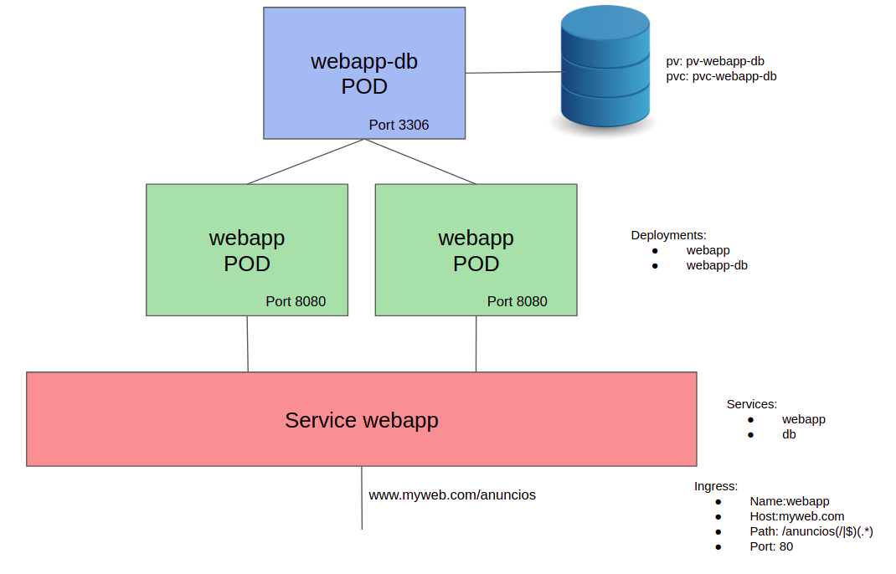

# webApp-kubernetes
Deployment of a Java WebApp with Kubernetes

This repo contains two possible ways to deploy the advertisements WebApp, with Kubectl and with Helm

## Steps to deploy the APP:

Common previous steps:
* Run command to be able to translate www.myweb.com domain name in Linux:

~~~
export MINIKUBE_IP=$(minikube ip)
echo $MINIKUBE_IP www.myweb.com | sudo tee --append /etc/hosts > /dev/null
~~~

* Create required folder /mnt/data in minikube node:
~~~
minikube ssh
sudo mkdir /mnt/data
~~~
* Options:
1. With Kubectl (in folder kubectl):
~~~
kubectl create -f 10g-volume.yaml
kubectl create -f mysql-pvc.yaml
kubectl create -f webapp.yaml
~~~
2. With Helm (in folder helm):
~~~
helm install webapp --name webapp
~~~
    
## The application is available in:
* www.myweb.com/anuncios

## Steps to stop the APP
* Options:
1. With Kubectl (in folder kubectl):
~~~
kubectl delete deployments db webapp
kubectl delete services db webapp
kubectl delete pvc mysql-pvc
kubectl delete pv 10g-volume
kubectl delete ingress ingress
~~~
2. With Helm (in folder helm):
~~~
helm delete --purge webapp
~~~

*Both folders include scripts to install and delete easily the App
